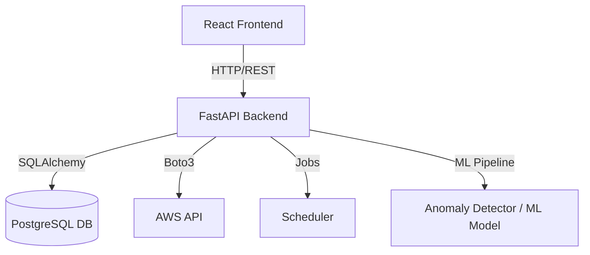

# Cloud Cost Optimizer ☁️💰

An automated cloud resource management and optimization system designed to analyze AWS infrastructures, detect cost anomalies, and generate actionable savings recommendations.

## Project Structure

```text
cloud-cost-optimizer/
│
├── backend/
│   ├── main.py                          ← FastAPI app entry point
│   ├── requirements.txt                 ← all Python packages
│   ├── .env                             ← secrets (never commit)
│   ├── .env.example                     ← template (commit this)
│   │
│   ├── app/
│   │   ├── api/
│   │   │   └── routes/
│   │   │       ├── auth.py              ← /auth/register, /auth/login
│   │   │       ├── aws.py               ← /aws/credentials
│   │   │       ├── sync.py              ← /sync (trigger data fetch)
│   │   │       ├── recommendations.py   ← /recommendations
│   │   │       └── anomalies.py         ← /anomalies
│   │   │
│   │   ├── core/
│   │   │   ├── config.py                ← reads .env, all settings
│   │   │   ├── security.py              ← JWT, bcrypt, encryption
│   │   │   ├── dependencies.py          ← get_current_user()
│   │   │   └── scheduler.py             ← daily auto-sync job
│   │   │
│   │   ├── db/
│   │   │   ├── base.py                  ← SQLAlchemy Base
│   │   │   ├── session.py               ← DB engine + SessionLocal
│   │   │   └── models/
│   │   │       ├── user.py              ← users table
│   │   │       ├── resource.py          ← cloud resources table
│   │   │       ├── recommendation.py    ← recommendations table
│   │   │       └── anomaly.py           ← anomalies table
│   │   │
│   │   ├── services/
│   │   │   ├── aws_service.py           ← real AWS API calls
│   │   │   ├── mock_data_service.py     ← fake data for testing
│   │   │   └── user_service.py          ← user DB operations
│   │   │
│   │   └── utils/
│   │       └── encryption.py            ← encrypt/decrypt IAM keys
│   │
│   ├── alembic/                         ← database migrations
│   └── tests/                           ← pytest tests
│
├── frontend/                            ← React UI Dashboard
├── ml/                                  ← ML Cost Anomaly Models
├── docker-compose.yml
├── .gitignore
└── README.md
```

## System Architecture



## Getting Started

### Prerequisites
- Python 3.10+
- Docker & Docker Compose
- PostgreSQL (if running locally without Docker)

### Run with Docker Compose
To spin up all services including DB, Redis, Backend, and Frontend:
```bash
docker-compose up --build
```

### Local Backend Setup
1. Navigate to backend:
   ```bash
   cd backend
   ```
2. Create and activate a virtual environment:
   ```bash
   python -m venv venv
   # On Windows:
   .\venv\Scripts\activate
   # On macOS/Linux:
   source venv/bin/activate
   ```
3. Install dependencies:
   ```bash
   pip install -r requirements.txt
   ```
4. Copy `.env.example` to `.env` and fill in secrets.
5. Run the FastAPI development server:
   ```bash
   uvicorn main.py --reload
   ```
   The API docs will be available at [http://127.0.0.1:8000/docs](http://127.0.0.1:8000/docs).
